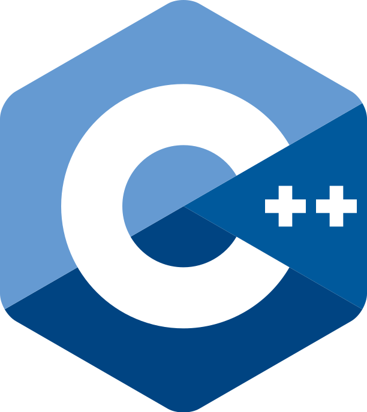

## 业余无线电爱好者

热爱业余无线电、热爱技术。高一学生。喜欢参与一些开源项目的讨论。

### **社交主页：**

-   <a href="https://www.qrz.com/db/BI7ACC"><code></code></a>：我的QRZ

### **技术栈:**

<a href="https://isocpp.org/"><code></code></a>
<a href="https://python.org/"><code></code></a>
<a href="https://nextjs.org/"><code></code></a>
<a href="https://www.tslang.cn/index.html"><code></code></a>
<a href="https://webpack.js.org/"><code></code></a>
<a href="https://cn.vitejs.dev"><code></code></a>
<a href="https://sass-lang.com"><code></code></a>
<a href="https://tailwindcss.com"><code></code></a>
<a href="https://go.dev/"><code></code></a>
<a href="https://www.docker.com"><code></code></a>

### Github 活跃度

